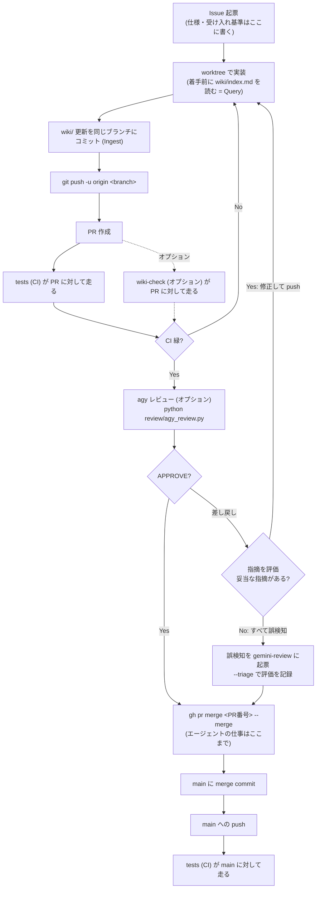

# 開発ワークフロー(Git / CI / CD)

このドキュメントは、AI エージェント(Claude Code 等)が複数セッションで並行作業することを
前提にした、日常の開発運用を 1 枚にまとめたテンプレートである。

- **エージェント向けの実行ルール**は リポジトリ直下の [CLAUDE.md](../CLAUDE.md) にある。
  本書はその背景・全体像を人間が読むためのもので、内容が食い違った場合は
  `CLAUDE.md` を正とする。
- 知識の蓄積(`wiki/`)については [wiki_workflow.md](wiki_workflow.md) を参照。
  仕様は Issue に、実装後の現状は `wiki/` に置き、**Wiki 更新は機能 PR に同梱する**。
- imev は CD を採用していない(配布も本番環境も無い)。CI の内容は下記「CI」を参照。

## 全体像

エージェントが行うのは Issue 起票から「CI 緑と agy レビューを確認して PR をマージする」まで。
マージ後は main への push で CI が再度走るだけで、デプロイは無い。



## 作業の進め方

エージェント向けの**逐次手順はスキルに分けて置いてある**
(`.agent/skills/<name>/SKILL.md`。Claude Code なら `.claude/skills/` に置く)。
本節は人間が全体像を掴むための要約で、細かい罠は各スキルに書いてある。

| 局面 | スキル | 主な内容 |
| --- | --- | --- |
| 着手 | `worktree-start` | Wiki を読む → Issue 確保 → `origin/main` から worktree |
| 実装後 | `wiki-ingest` | 影響ページの更新 → `log.md` 追記 → wiki-lint |
| 完了 | `pr-finish` | push → PR → CI → (agy レビュー)→ マージ → 後始末 → Issue クローズ → メインツリー更新 |
| CI 緑の後 | `agy-review`(オプション) | agy でレビュー → 差し戻しを評価 → 修正ループ / 誤検知を起票してマージ |
| 作業中 | `file-issue` | スコープ外の問題をその場で起票(対象の判断・粒度・本文) |
| 依頼時 | `wiki-lint` | Wiki の健康診断(機械検査 → 矛盾・乖離の洗い出し) |

### 1. 開始 — worktree を作る

```bash
git fetch origin
git worktree add ../imev-<名前> -b <branch> origin/main
```

- ブランチ名は `fix/xxx` / `feature/xxx` / `chore/xxx` / `docs/xxx`。
- **ローカル `main` ではなく `origin/main` から切る**。
- worktree はリポジトリの外の兄弟ディレクトリに置く。

複数セッションが同時に作業するため、1 つの作業ツリーを共有すると HEAD を奪い合い、
自分のコミットが他人のブランチ上に載る事故が起きる。worktree はその防止も兼ねる。

### 2. コミット

- コミットメッセージは `feat:` / `fix:` / `docs:` / `chore:` + 概要。
- **`git add` はファイルを明示指定する。** 他セッションの未コミット変更が
  作業ツリーに混ざっていることがあるため、`git diff --cached` で
  ステージ内容を確認してからコミットする。
- **`wiki/` の更新を同じブランチに含める。** コミットは分けてよい(`docs: wiki を更新`)が、
  PR は分けない。実装と知識の反映がずれると Wiki は腐る。

### 3. 完了 — PR を作って CI を通してマージ

```bash
git push -u origin <branch>
gh pr create --title "<一文>" --body "<対応 Issue / 変更内容 / Wiki の 3 節>"
gh pr checks <PR番号> --watch             # CI を導入している場合、成功を確認
gh pr merge <PR番号> --merge
git push origin --delete <branch>
cd <メインツリー>                          # worktree の中からは削除できない
git worktree remove ../imev-<名前>
```

- **main へ直接 push・直接マージしない。** 必ず PR を経由する。
- CI が失敗したらマージせず原因を調査する。修正が困難なら PR は開いたまま報告する
  (勝手に close しない)。
- **`gh pr create --fill` を使わない。** 本文をコミットメッセージから生成するため、
  規約が要求する「対応 Issue」「Wiki」の節を満たせない。`--body` で明示する。
- **PR 本文・コミットメッセージに `Fixes #` / `Closes #` を書かない。** 自動クローズされると
  後段の `gh issue close --comment` が `already closed` で失敗し、実装内容の要約が
  Issue に残らないまま手順が中断する。素の `#<番号>` 参照に留める。
- **`gh pr merge` に `--delete-branch` を付けない。** worktree 内で実行すると `gh` が
  マージ後に `main` へ checkout しようとして
  `fatal: 'main' is already used by worktree at ...` で失敗する。
  **マージ自体は成功している**ので、エラーを見てマージ失敗と誤読しないこと
  (リモートブランチ削除に到達しないだけ。`git push origin --delete` で消す)。

## CI

### ブランチ保護 — これを入れないと CI はゲートにならない

**ワークフローを置いただけでは、マージは一度も止まらない。** GitHub Actions のジョブが赤くても
`gh pr merge` はそのまま通る。マージを止めているのは常に**ブランチ保護の必須チェック**であり、
ワークフローはその判定材料を作っているだけである。

**この設定はリポジトリ側にあり、テンプレートのコピーには引き継がれない。** 新しく作った
プロジェクトでは毎回手で有効化すること。飛ばすと、CI が緑でも赤でもマージできる状態のまま
「CI 緑を確認してマージ」という手順だけが回り続ける。

```bash
gh api --method PUT repos/kant0123/imev/branches/main/protection \
  --input .github/branch-protection.json
```

同梱の [.github/branch-protection.json](../.github/branch-protection.json) は
`test` を必須チェックにする。採用していないワークフローの名前は `contexts` から
外すこと — **一度も実行されないチェックを必須にすると、PR が永久に pending のまま
マージできなくなる。**

| 設定 | 値 | 理由 |
| --- | --- | --- |
| `required_status_checks.contexts` | 採用したジョブ名 | `jobs:` 直下のキーであって、ワークフロー名 (`name:`) ではない |
| `required_status_checks.strict` | `false` | `true` にすると main が進むたび全 PR で再 push が要る |
| `required_pull_request_reviews` | `null` | **1 人開発では設定してはいけない。** 自分の PR は自分で承認できず、誰もマージできなくなる |
| `enforce_admins` | `false` | 障害時に管理者が手で復旧する逃げ道を残す |

`wiki:skip` ラベルで外したジョブは **skipped = 成功**として扱われるため、
必須チェックにしても逃げ道は塞がらない。

agy レビューはローカルで agy を動かすため CI のチェックにはならず、ブランチ保護では強制できない。
代わりに [.claude/hooks/check_agy_review.sh](../.claude/hooks/check_agy_review.sh) が
`gh pr merge` の直前に発火し、head SHA に対するレビュー記録が PR に無ければマージを差し止める
(詳細は下記「agy レビュー」)。hook は Claude Code を使っているときしか動かず、
GitHub の画面から押されたマージは素通しになる。

### CI — `tests` ワークフロー

[.github/workflows/test.yml](../.github/workflows/test.yml)

| 項目 | 内容 |
| --- | --- |
| 契機 | `push`(全ブランチ)と `pull_request` |
| ジョブ | `checks`(Python・シェル・PowerShell の構文、`.ps1` の BOM、review と hook のテスト)と `mozc-patch`(パッチが基準コミットに当たるか) |

Mozc のビルドは CI に載せない。理由は [wiki/overview.md](../wiki/overview.md) の「運用」。
CD は採用していない。

### `wiki-check`(オプション)

[.github/workflows-optional/wiki-check.yml](../.github/workflows-optional/wiki-check.yml)

PR に `wiki/` の更新が含まれているかを確認する。既定は**警告のみで success** するので
マージは止まらない。必須ゲートにしたい場合はワークフロー末尾の `exit 0` を `exit 1` に変える。
Wiki 更新が不要な PR には `wiki:skip` ラベルを付ける。

ローカル側の同等チェックとして
[.claude/hooks/check_wiki_updated.sh](../.claude/hooks/check_wiki_updated.sh) がある
(`gh pr create` の直前に発火し、Wiki 未更新なら PR 作成をブロックする)。

### `wiki-lint`(オプション)

[.github/workflows-optional/wiki-lint.yml](../.github/workflows-optional/wiki-lint.yml)

`wiki/` の**中身が整合しているか**を機械チェックする(壊れた `[[リンク]]`・孤立ページ・
`index.md` の掲載漏れ・frontmatter の不備・`updated` と最終コミット日のズレ・
`related` の片方向参照)。違反があれば落ちる。`wiki-check` が「**Ingest したか**」を見るのに対し
こちらは「**中身が正しいか**」を見るので、役割が違い併用できる。

- **Wiki を運用するなら実質的に必須。** エージェントは 1 ページ内で完結する規約(frontmatter を
  書く、テンプレートに従う)はよく守るが、Wiki 全体にまたがる大域的な一貫性は自然には保てない。
  壊れるのは常に後者なので、機械に見張らせる。
- **`tests` に相乗りさせない。** Wiki の不整合 1 件でテストのワークフロー全体が赤くなり、
  コードの検査結果と混ざるため、独立したワークフローに分ける。
- `fetch-depth: 0` が要る。`updated` を各ファイルの最終コミット日と突き合わせるため、既定の
  浅いクローンでは履歴が足りず、**スクリプトは日付の検査を黙って飛ばす**(通っているのに
  何も見ていない状態になる)。
- ローカルでは `node scripts/wiki-lint.js`。**コミットしてから**走らせる(未コミットだと
  `updated` が古いと言われる)。

### agy レビュー(オプション・既定で有効)

CI のワークフローではなく、**CI が緑になった後にエージェントがローカルで実行する**
([review/agy_review.py](../review/agy_review.py))。差分を agy 経由で Gemini にレビューさせ、
結果を PR コメントに残す。手順は `agy-review` スキル、設計判断は [review/README.md](../review/README.md)。

- **CI 緑が前提。** スクリプトは `gh pr checks` が緑でなければ実行を拒否する。
- **記録は head SHA ごと。** push すると未レビューに戻る。
- 差し戻し(CRITICAL / WARNING)があれば、エージェントが指摘を評価する。妥当なら修正して
  push → CI → 再レビュー。すべて誤検知なら `kant0123/gemini-review` に起票し、
  `--triage` で評価を PR に記録してからマージする。
- `gh pr merge` の hook がレビュー記録(差し戻しなら評価の記録も)を確認する。
- 前提: `agy` がインストール・ログイン済みで、PATH に通っていること。
- **導入直後は強制が効かない。** hook もスクリプトもメインツリーから読まれるため、導入 PR が
  メインツリーに反映されるまではレビューを素通しする。
  導入手順と注意点は [review/README.md](../review/README.md) の「導入するときの注意」。
- ドメイン不変条件は `--domain` か環境変数 `REVIEW_DOMAIN` で切り替える
  (`ime` / `general` / `fintech` / `distributed` / `healthcare` / `embedded`)。未設定なら `ime`
  (imev 向けに足したもの。テンプレートの既定は `general`)。

### `label-hygiene`(オプション)

[.github/workflows-optional/label-hygiene.yml](../.github/workflows-optional/label-hygiene.yml)

GitHub Issues / Projects 連携を使う場合の補助ワークフロー。Issue クローズ時に
`status:blocked` ラベルが残っていれば自動で外す。Issues 連携を使わないなら不要。

## やってはいけないこと

| 禁止 | 理由 |
| --- | --- |
| 実装作業をメインツリーで行う | 複数セッションの HEAD 奪い合い |
| main へ直接 push・直接マージ | CI がゲートとして機能しない(マージ後に走るだけになる) |
| `git add -A` / `git add .` | 他セッションの未コミット変更を巻き込む |
| `gh pr create --fill` | PR 本文が規約(対応 Issue / Wiki)を満たさなくなる |
| PR 本文の `Fixes #` / `Closes #` | 自動クローズで `gh issue close --comment` が失敗し、要約が残らない |
| `gh pr merge --delete-branch`(worktree 内) | `main` への checkout に失敗する。マージ済みなのに失敗と誤読される |
| worktree 削除の失敗後に手で `rm -rf` / `Remove-Item` | git が working tree と認識しなくなり `--force` でも回復しない |

## トラブルシュート(worktree)

| 症状 | 確認すること |
| --- | --- |
| `git worktree remove` が必ず失敗する | シェルの作業ディレクトリが削除対象の中にある。`../imev-<名前>` は **worktree の中からでも自分自身に解決する**ので、パスを見ただけでは気づけない。メインツリーに `cd` してから実行する |
| `Permission denied` で削除できない | ディレクトリに ReadOnly 属性が付いている(クラウドストレージのミラー同期・バックアップツールが親を掴んでいる場合など)。`scripts/worktree-cleanup.ps1` で属性を外してから git に削除させる |
| `fatal: ... is not a working tree` で `--force` も効かない | 一度削除に失敗した後の状態。手で消さず `scripts/worktree-cleanup.ps1`(引数なし)で孤立エントリを掃除する |
| `git worktree list` に出ないディレクトリが残っている | 削除失敗の残骸。`-RemoveDirs` で消せるが**未コミットの変更ごと消える**ので中身を確認してから |
